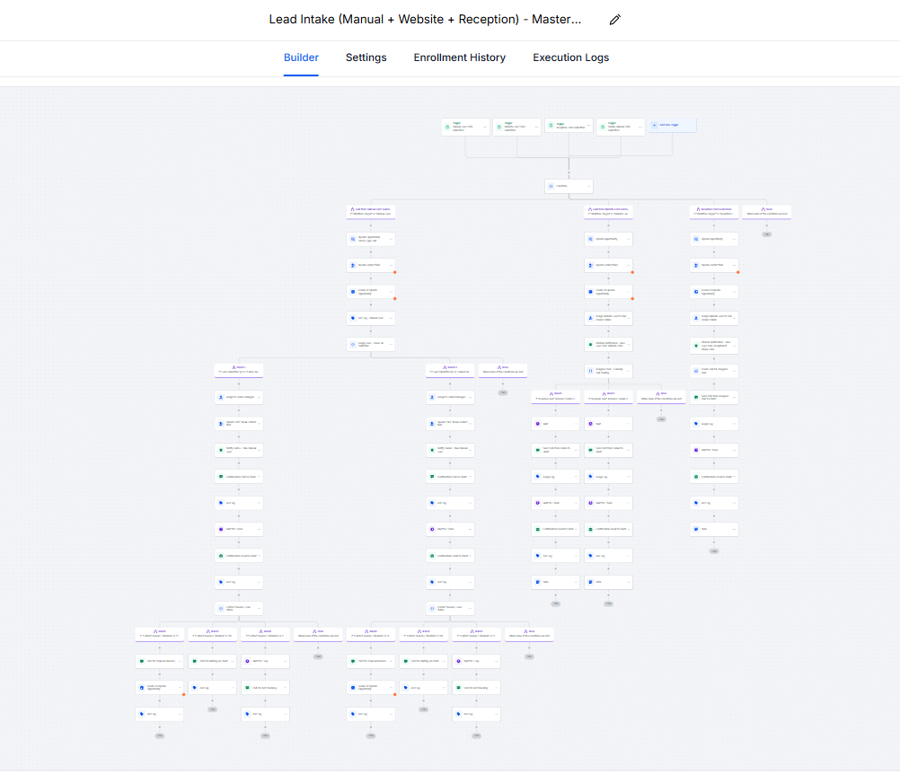

## Overview:
This project showcases a fully automated, production-ready client lifecycle system built for a construction company to manage leads, sales activities, project creation, and long-term re-engagement using no-code automation platforms.

The system was designed to eliminate manual data entry, ensure data accuracy, and provide a scalable foundation for business growth.

## Problem
The client faced multiple operational challenges:

- Leads arriving from multiple sources (website, calls, emails, referrals) with no unified system
- Manual data entry causing inconsistencies and data loss
- Limited visibility into sales outreach and follow-ups
- Disconnected CRM and project management systems
- High dependency on manual coordination between sales and operations

This resulted in missed follow-ups, slower response times, and inefficient project handoffs.

## Solution:

I designed and implemented a centralized automation architecture using GoHighLevel as the CRM layer and Zapier as the integration bridge to JobTread.

## Core Tools Used:
- GoHighLevel (GHL) – CRM, pipelines, workflows, communication
- Zapier – Integration layer between GHL and JobTread
- JobTread – Project management & estimating system
- APIs & Webhooks – Workflow triggers and data synchronization

## Key Features:
- Multi-Source Lead Intake
- Website forms
- Manual internal intake
- Receptionist intake
- Referrals & walk-ins
- Data Reliability & Mapping
- Custom field architecture to solve GHL checkbox/multi-select limitations
- 100% data consistency across Contacts and Opportunities
- Sales Pipeline Automation
- Automatic opportunity creation
- Stage progression logic
- Follow-up sequences
- Activity Tracking
- Call, SMS, and Email activity tagging
- Clear visibility into sales outreach
- CRM → Project Management Sync
- Automated project creation in JobTread when deals reach defined stages
- Clean separation of CRM and project execution logic
- Re-Engagement & Lifecycle Automation
- Long-term nurture workflows for completed or closed leads
- Relationship retention and future project opportunities
- Scalable Architecture
- Easy to extend with new lead sources, automations, or reporting layers

## Impact:
- Reduced manual data entry across sales and operations
- Eliminated data loss between intake and pipeline creation
- Faster response times to new leads
- Full visibility into lead status and sales activities
- Scalable system ready for future growth without rework
- Use Case Fit

## DEMO:

## Built By:
Yasir Sattar
Automation Architect | Workflow Automation Engineer
Specializing in n8n, GoHighLevel, Zapier, AI-assisted workflows, and CRM systems

