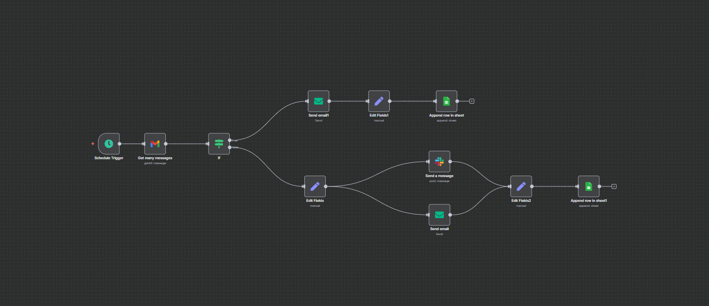

# Automated Lead Notification & Logging System — n8n (Gmail + Slack + Google Sheets)

**Tools Used:** n8n · Gmail · Slack · Google Sheets · IF Node · Email Node

## Problem
Manual triaging of emails wasted valuable time and led to delays in handling urgent inquiries. The team needed a way to quickly detect high-priority emails and ensure proper follow-up while maintaining a clean log of all leads.

## Solution
Created an **n8n workflow** that:
- **Trigger (Gmail):** Checks new emails at defined intervals.
- **Conditional Logic (IF Node):**
  - If email contains keyword **"urgent"**:
    - Sends immediate custom email alert.
    - Logs entry in Google Sheets.
  - If not urgent:
    - Sends formatted notification to Slack.
    - Sends a standard email alert.
    - Logs entry in Google Sheets.
- **Slack Node:** Posts sender, subject, snippet, and date in a chosen Slack channel.
- **Google Sheets Node:** Appends all entries (urgent or general) to a central sheet for reporting.

## Features
1. Gmail Trigger (Scheduled checks).
2. Keyword-based urgency detection.
3. Slack Alerts with structured details.
4. Dual Email Alerts — urgent vs. general.
5. Google Sheets logging for reporting and tracking.

## Impact
- **Instant alerts** for urgent leads → faster response times.
- **Organized logs** in Google Sheets → no lead slips through cracks.
- **Reduced manual triage time** → more focus on actual client engagement.

## Flow (high level)
Gmail Trigger → IF (urgent?)  
→ True: Email Alert + Google Sheets Log  
→ False: Slack Message + Email Alert + Google Sheets Log

## Demo  

## Import / Run
1. Import `Workflow.json` into your n8n instance.
2. Configure credentials:
   - Gmail OAuth
   - Slack Webhook or Bot Token
   - Google Sheets API credentials
   - SMTP for sending alerts
3. Adjust keyword logic ("urgent") if needed.
