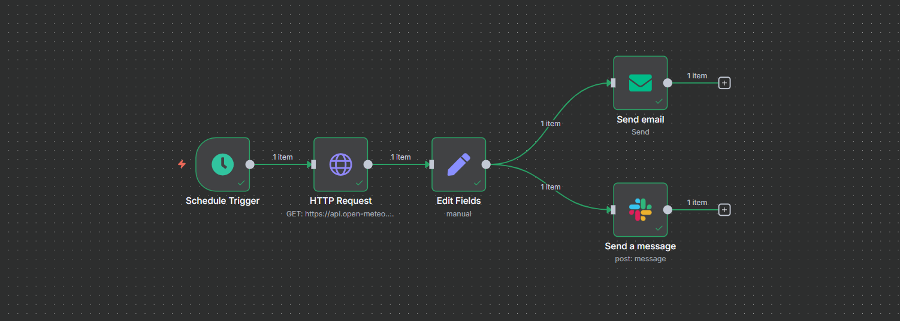

# Daily Weather Update — n8n

**Tools Used:** n8n · HTTP Request · Slack · Email

## Problem
Team members needed a quick, automated way to receive the daily weather forecast for Islamabad to plan activities. Manual checks were inefficient.

## Solution
Built a scheduled **n8n workflow** that:
- **Trigger (Cron):** Runs daily at 8:00 AM.
- **HTTP Request Node:** Fetches weather data from a free API (Open-Meteo).
- **Slack Node:** Sends a formatted weather update to a specific channel.
- **Email Node:** Delivers the same weather information via email.

## Impact
- Automated daily weather updates.
- Saves time compared to manual checks.
- Provides consistent multi-channel notifications (Slack + Email).

## Flow (high level)
Cron Trigger → HTTP Request (weather API) → Slack Message → Email Message

## Demo
_Add screenshots here once uploaded:_  

## Import / Run
1. Import `Workflow.json` into your n8n instance.
2. Configure credentials:
   - Slack Webhook URL or Slack App Bot Token.
   - SMTP credentials for Email.
3. Adjust the **location (Islamabad)** in the HTTP Request node if needed.

## Environment Template
Create `.env.example` in this folder:
